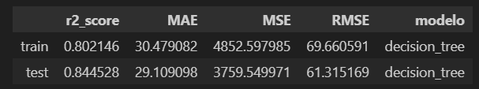
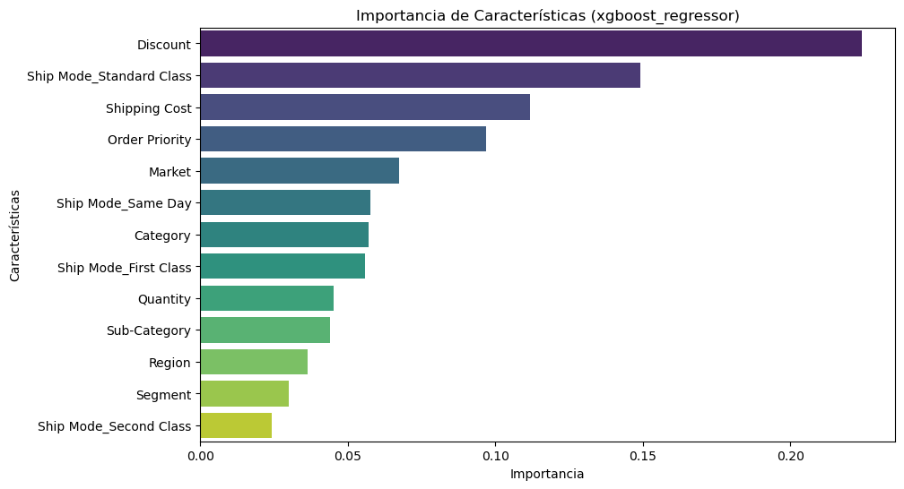
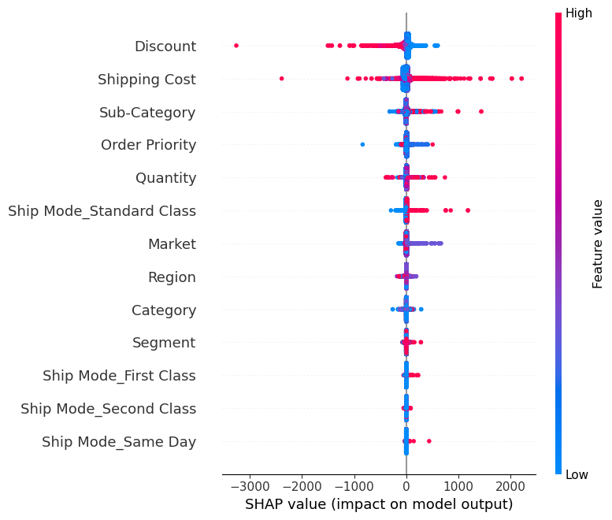
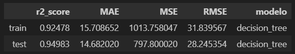
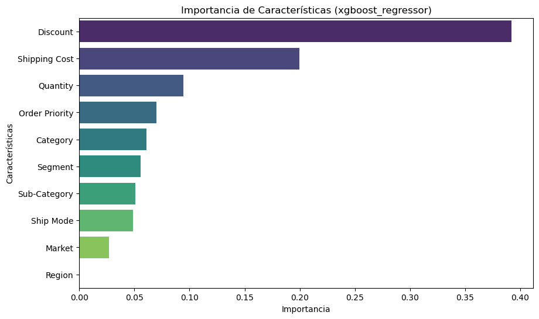
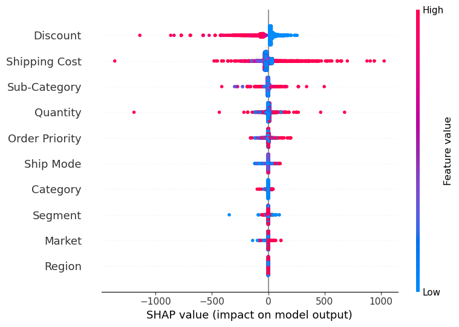
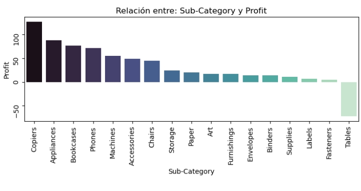

# Proyecto 9: 

## 🎯 Objetivo


## Estructura del Proyecto 🗂️

```bash
Proyecto9-Clustering/
├── datos/                      # Archivos de datos CSV y PKL para el proyecto.
│   ├── 01_clustering/          # Archivos PKL de los datos para realizar los clusters.
│   ├── 02_regresiones/         # Archivos PKL de los datos para realizar las regresiones.
│   ├── 03_encoders/            # Archivos PKL de los modelos, encoders.. utilizados en los modelos.
│
├── jupyter_notebooks/          # Notebooks de Jupyter con los modelos probados.
│   ├── Modelo X/               # Carpeta del modelo
│   │   ├── 01_Clustering/      # Carpeta con lo realizado para generar los clusters
│   │   ├── 02_Regresion_Cluster_1/ # Modelos Predictivos con el Cluster 1
│   │   ├── 03_Regresion_Cluster_2/ # Modelos Predictivos con el Cluster 2
│ 
├── src/                        # Archivos .py para funciones auxiliares del proyecto.
│
└── README.md                   # Descripción del proyecto, instrucciones de instalación y uso.
```

# Instalación y Requisitos 🛠️

## Requisitos

Para ejecutar este proyecto, asegúrate de tener instalado lo siguiente:

- **Python 3.x** 🐍
- **Jupyter Notebook** 📓 para ejecutar y visualizar los análisis de datos
- **Bibliotecas de Python**:
    - [pandas](https://pandas.pydata.org/docs/) para manipulación y análisis de datos 🧹
    - [numpy](https://numpy.org/doc/stable/) para cálculos numéricos y manejo de matrices 🔢
    - [matplotlib](https://matplotlib.org/stable/index.html) para crear gráficos básicos 📊
    - [seaborn](https://seaborn.pydata.org/) para visualizaciones estadísticas avanzadas 📈
    - [tqdm](https://tqdm.github.io/) para mostrar barras de progreso en procesos largos ⏳
    - [xgboost](https://xgboost.readthedocs.io/) para la implementación de modelos basados en Gradient Boosting 🌟
    - [scikit-learn](https://scikit-learn.org/stable/) para modelado predictivo y preprocesamiento, incluyendo:
        - `LinearRegression`, `DecisionTreeRegressor`, `RandomForestRegressor`, `GradientBoostingRegressor`, y `XGBRegressor` para tareas de regresión
        - `train_test_split`, `GridSearchCV`, `KFold`, `LeaveOneOut` y `cross_val_score` para partición de datos y validación de modelos
        - `StandardScaler` para el escalado de variables
        - Métricas como `r2_score`, `mean_squared_error`, `mean_absolute_error` para evaluar los modelos
    - [pickle](https://docs.python.org/3/library/pickle.html) para serializar y cargar modelos y objetos 🛠️

## Configuración Adicional

- Configura `pd.options.display.float_format` para un formato más claro en los valores flotantes.
- Añade rutas personalizadas al sistema usando `sys.path.append` para facilitar el acceso a los módulos personalizados del proyecto.

## Instalación 🛠️

1. Clona este repositorio para visualizarlo en vscode:
```bash
git clone https://github.com/apelsito/Proyecto9-Clustering.git
cd Proyecto9-Clustering
```

# Resumen de lo realizado en el Modelo final: 
### Clustering
- En el análisis inicial elimino las siguientes columnas
    - ['Row ID','Order ID','Order Date','Ship Date','Customer ID','Customer Name','City','State','Country','Postal Code','Product Name']
- No voy a tocar los outliers en esta fase, considero que son datos de ventas realistas que ahora mismo buscamos agrupar en clusters
- Volvemos categoría las siguientes columnas
    - ["Ship Mode","Segment","Market","Region","Category","Sub-Category","Order Priority"]

- Realizamos Frequency Encoding a todas las columnas salvo a "Product ID"

- Utilizando Robust Scaler, aplicamos feature scaling

- Ponemos como índice la columna "Product ID"

- Realizamos un Silhoutte Score Elbow para realizar el Kmeans

- Realizamos Kmeans dividiendo en 2 grupos

- Utilizando el "Product ID" realizamos un left merge al Dataframe original de la columna "clusters_kmeans"

# Modelos de Predicción
Dividido por Market son los siguientes:
### Cluster 1
- US
- APAC
- EU
- LATAM
### Cluster 2
- Africa
- EMEA
- Canada
### Fase 1: EDA y Ajuste de Datos
- Se eliminan las Columnas ['Row ID','Order ID','Order Date','Ship Date','Customer ID','Customer Name','City','State','Country','Postal Code','Product ID','Product Name']

- Se elimina "Sales" Tras ver las correlación

- Se convierten a tipo "category" las columnas de tipo "Object"
### Fase 2: Encoding
- Se utiliza Kruskal para medir el orden de las columnas

- Se realiza Target Encoding con las columnas ordinales

- Se realiza OneHot Encoding con las columnas nominales
### Fase 3: Feature Scaling
- Se utiliza Robust Scaler para normalizar los valores
### Fase 4: Gestión Outliers
- Se analizan pero no se gestionan en este modelo
### Fase 5: Modelos Predictivos
- Se realiza Decision Tree 

- Se realiza XGBoost

# Resultados del Mejor Modelo (Modelo 1)
## Cluster 1
Mejor Modelo: XGBoost
### Métricas

### Importancia

### Shap Plots

## Cluster 2
Mejor Modelo: XGBoost
### Métricas

### Importancia

### Shap Plots


# Conclusiones:
A partir de los resultados obtenidos podemos responder a las siguientes preguntas:

### ¿Cómo podemos agrupar a los clientes o productos de manera significativa?

Los productos los podemos agrupar por mercados en dos grupos, tenemos 4 mercados que tienen más compras que otros 3, por lo que los podemos separar en 2 grupos que contienen los siguientes mercados:
- Grupo 1: 
    - US
    - APAC
    - EU
    - LATAM
- Grupo 2:
    - Africa
    - EMEA
    - Canada

De esta forma mantenemos los datos equilibrados a la hora de realizar el análisis del profit, pero no generamos un modelo con datos demasiados disparejos que podrían dificultar las predicciones.
### ¿Qué factores son más relevantes para predecir el beneficio o las ventas dentro de cada grupo?
Observando ambas Gráficas de Importancia:
-** Descuento (Discount)**: Es el factor más influyente, indicando que la cantidad de descuento otorgada tiene un impacto significativo en las predicciones.
- **Costo de Envío (Shipping Cost)**: Influye de manera importante en las predicciones. Los costos de envío parecen estar correlacionados con el beneficio.
- **Cantidad (Quantity)**: La cantidad de productos vendidos tiene una relevancia considerable en las predicciones.

### ¿Cómo podemos utilizar estos insights para tomar decisiones estratégicas?

Analizando las subcategorías del cluster 1 observamos que:

- Las Mesas (Tables) Generan pérdidas, habría que ver la razón, si es que se han dado demasiados descuentos, o que no se calcula correctamente el coste de envío

Además observando el resto de métricas podríamos aplicar los siguiente:
- Política de Descuentos: Diseñar descuentos personalizados según el producto, el cliente y el mercado para maximizar el beneficio sin reducir márgenes innecesariamente.

- Nuevas Estrategias de Envío: Analizar opciones logísticas para reducir costos, especialmente en mercados sensibles al precio del envío.

- Adaptación al Mercado: Dependiendo del Mercado deberemos aplicar políticas adaptadas

# Contribuciones 🤝

Las contribuciones a este proyecto son muy bienvenidas. Si tienes alguna sugerencia, mejora o corrección, no dudes en ponerte en contacto o enviar tus ideas.

Cualquier tipo de contribución, ya sea en código, documentación o feedback, será valorada. ¡Gracias por tu ayuda y colaboración!

# Autores y Agradecimientos ✍️

## Autor ✒️
**Gonzalo Ruipérez Ojea** - [@apelsito](https://github.com/apelsito) en github

## Agradecimientos ❤️
Quiero expresar mi agradecimiento a **Hackio** y su equipo por brindarme la capacidad y las herramientas necesarias para realizar este proyecto con solo una semana de formación. Su apoyo ha sido clave para lograr este trabajo.
